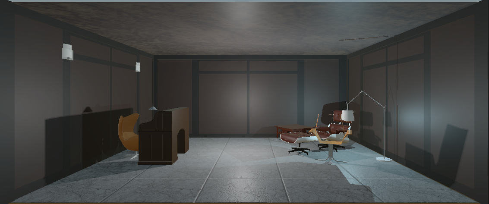

# VR-Therapist-Virtual-Mental-Health-Experience

## Overview

**VR-Therapist-Virtual-Mental-Health-Experience (VR-Therapist)** is a cutting-edge application integrating Virtual Reality (VR) technology and Large Language Models (LLMs) to simulate therapeutic interactions for mental health rehabilitation. This project provides a virtual therapist environment where users can experience immersive and interactive therapy sessions.

## Features

- **Immersive Therapy:** Offers a virtual therapist in a realistic VR environment.
- **AI-Driven Responses:** Utilizes LLMs to generate therapeutic dialogue in real-time.
- **Customizable Interaction:** Allows for dynamic interaction based on user input.
- **Virtual Environments:** Provides various virtual settings for different therapeutic needs.

## Project Structure

### 1. Figures and Media

- **Figures:** Important figures illustrating the VR environment and system architecture.
- **PDF:** The research paper detailing the project.
- **Presentation:** Project presentation slides.
- **Demo:** A video demo.

### 2. Codebase

The project consists of two main components:
- **Flask Python Server:** Handles the backend processing, including speech-to-text conversion and LLM interaction.
- **Unity Project:** Manages the VR environment and user interaction.

## Setup and Installation

### 1. Flask Python Server

#### Requirements

- Python 3.x
- Flask
- Google Speech-to-Text API
- AWS Polly

#### Installation

1. Clone the repository:
   ```bash
   git clone https://github.com/mahmoud1yaser/VR-Therapist-Virtual-Mental-Health-Experience

   cd VR-Therapist-Virtual-Mental-Health-Experience/Server
   ```

2. Install the required packages:
   ```bash
   pip install -r req.txt
   ```

3. Create a config.json file based on the provided example in ```Server/config.json.example```.
    - You will need to obtain the following keys:
        - POE Session Key (Note: The [POE API](https://github.com/snowby666/poe-api-wrapper) service is currently under maintenance and may not be functional at this time.)
        - AWS Polly ACCESS-Key and SECRET-ACCESS-Key

4. Run the Flask server:
   ```bash
   python app.py
   ```

### 2. Unity Project

#### Requirements

- Unity 2022.x or later
- VR Headset (Oculus Rift, HTC Vive, etc.)

#### Installation

1. Open Unity Hub and add the project:
   ```bash
   Open Unity Hub > Add Project > Select `VR-Therapist-Virtual-Mental-Health-Experience/VR-Game`
   ```

2. Go to `Assets/Scenes/Menu` and run the scene:
   ```bash
   In Unity Editor > Add Project > Assets > Scenes > Menu > Open and Run
   ```

## How to Use

1. **Start the Flask Server:** Ensure the Flask server is running by following the steps in the Flask Python Server section.
2. **Run the Unity Project:** Open and run the MainMenuScene in Unity as described.
3. **Initiate Therapy Session:** Wear the VR headset, and follow the on-screen instructions to start a therapy session. The virtual therapist will interact with you based on your inputs.

## Figures

- **System Diagram:**
  
  
- **Side and Top View of the Environment:**
  
  
  
- **Isometric View of the Environment:**
  
  

- **Patient Eye Tracking:**
  
  
- **Therapist Lip Sync:**
  

## Resources

- **[Research Paper (PDF)](assets/pdf/Project_Paper.pdf)**
- **[Project Presentation (PDF)](assets/pdf/Project_Slides.pdf)**

## Demo
We have prepared a demo video to showcase the features and functionality of the VR-Therapist-Virtual-Mental-Health-Experience. The video includes a walkthrough of the system, including setting up the environment, starting a therapy session, and interacting with the virtual therapist.

[](https://www.youtube.com/watch?v=x633kQ59pfw)

## Future Work
- **LLM Fine-Tuning:** Enhance LLM performance for more accurate therapeutic responses.
- **Integration of Retrieval-Augmented Generation (RAG):** Incorporate real-time information retrieval to improve response relevance.
- **Expansion of Therapy Modules:** Add more psychological treatment methodologies.
- **Creation of Diverse Virtual Environments:** Design various customizable virtual settings.
- **Customization of Virtual Therapist:** Allow personalization of the therapist's appearance and interaction style.
- **Patient History Management and Analysis:** Implement secure data handling for personalized therapy.

## Contributors

- Mahmoud Yaser - [mahmoud.salman01@eng-st.cu.edu.eg](mailto:mahmoud.salman01@eng-st.cu.edu.eg)
- Ibrahim Mohamed - [ibrahim.mohamed01@eng-st.cu.edu.eg](mailto:ibrahim.mohamed01@eng-st.cu.edu.eg)
- Ahmed Hassan - [ahmed.ali009@eng-st.cu.edu.eg](mailto:ahmed.ali009@eng-st.cu.edu.eg)
- Maha Medhat - [maha.mostafa011@eng-st.cu.edu.eg](mailto:maha.mostafa011@eng-st.cu.edu.eg)
- Mohamed Ismail - [mohamed.darwish02@eng-st.cu.edu.eg](mailto:mohamed.darwish02@eng-st.cu.edu.eg)

## License

This project is licensed under the MIT License.
